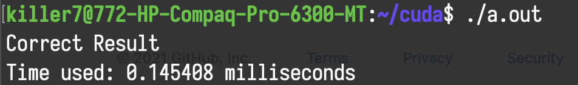
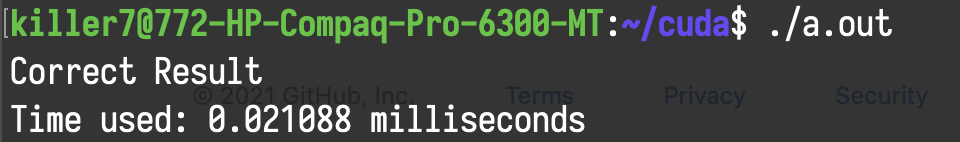
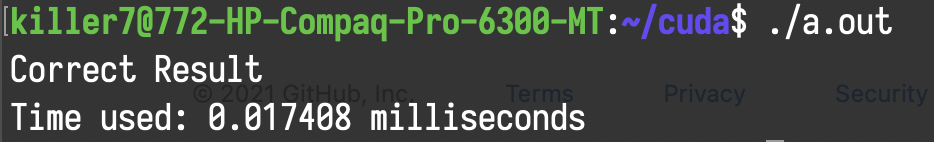
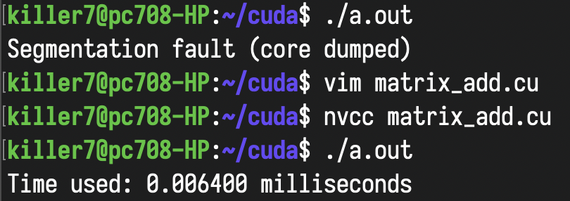
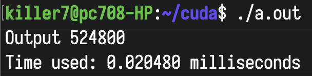
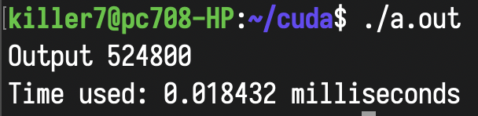

# ParallelProgramming

## Running time of 1D Stencil

### Single thread

### Multiple threads

### Multiple Faster threads

## Running time of Matrix Addition

### When N is 800

## Running time of Reduce

### Interleave addressing by using per-block shared memory

### Contiguous addressing by using per-block shared memory
